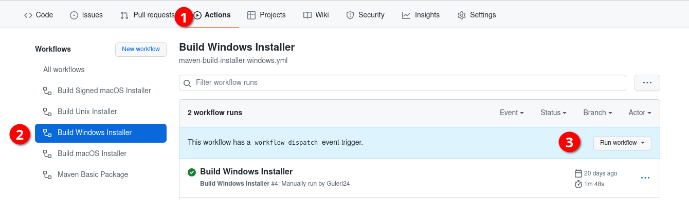

# FIS Global
## To run this application from the source
`./mvnw clean javafx:run` in linux

`./mvnw.cmd clean javafx:run` in windows

## Requirement for this project
JDK 17 only and the rest is pulled by the mvn wrapper for you.

## To create application packages
1. Push the edits
2. Follow these steps to build your package using GitHub actions

In the 3rd case, when you click the button there is option to build the latest push using GitHub Action.
You basically request GitHub to build this package for me.
3. And Similar for other OS's like Mac (.dmg) and Linux (.deb, .rpm)
